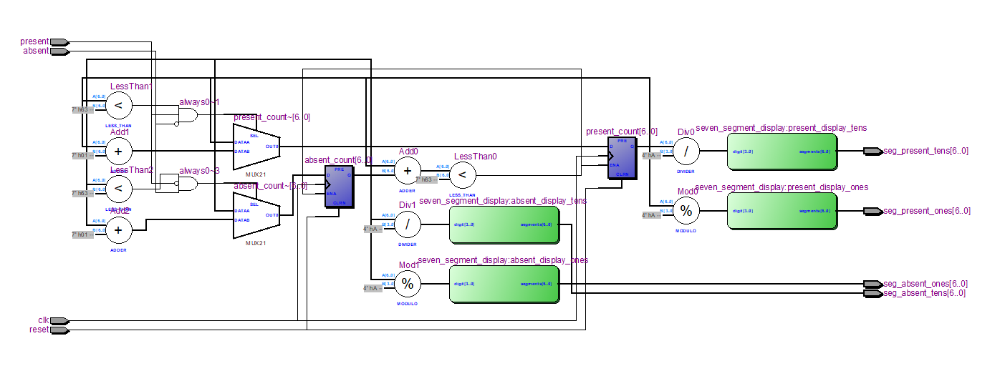
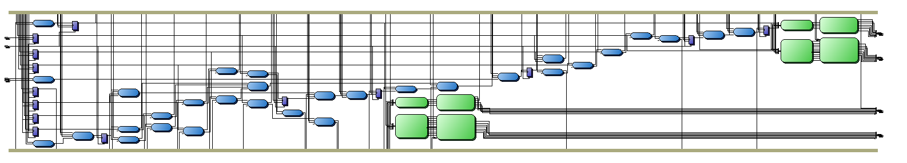
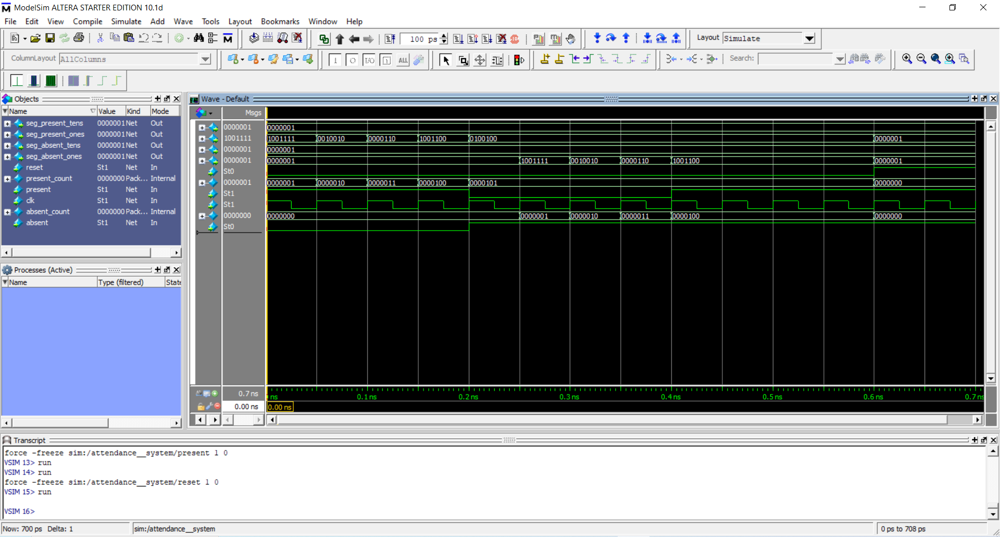

# 🎓 Attendance Management System

> A hardware-level attendance tracking system implemented in **Verilog HDL**, designed for FPGA deployment with real-time 7-segment display output.

---

## 📌 Project Overview

This project implements a digital **Attendance Management System (AMS)** using Verilog HDL. The system counts present and absent individuals using sequential logic, enforces a cap of **99 total entries**, and displays counts in real time on a **4-digit 7-segment display**.

---

## 🧠 Features

- ✅ Separate counters for **Present** and **Absent** students
- ✅ Overflow protection — total count capped at **99**
- ✅ Real-time output on **dual 2-digit 7-segment displays**
- ✅ Synchronous **clock** and **reset** control
- ✅ Verified via **ModelSim simulation**
- ✅ RTL and TTL schematics generated in Quartus

---

## 🗂️ Repository Structure

```
Attendance_System/
├── attendance__system.v   # ⭐ Main Verilog source code
├── rtl.PNG                # RTL schematic view (Quartus)
├── ttl.PNG                # TTL schematic view (Quartus)
├── Simulation.PNG         # ModelSim simulation waveform
└── README.md
```

---

## ⚙️ How It Works

### Logic Summary

| Input State | Action |
|---|---|
| `present=1, absent=0` | Increment `present_count` |
| `present=0, absent=1` | Increment `absent_count` |
| `present=1, absent=1` | No change (invalid — ignored) |
| `present + absent ≥ 99` | Count held (overflow prevention) |
| `reset=1` | Both counters reset to **0** |

---

## 💻 Verilog Modules

### `attendance__system` (top-level)

| Port | Direction | Description |
|---|---|---|
| `clk` | Input | System clock |
| `reset` | Input | Active-high synchronous reset |
| `present` | Input | Mark one student as present |
| `absent` | Input | Mark one student as absent |
| `seg_present_ones[6:0]` | Output | 7-seg ones digit of present count |
| `seg_present_tens[6:0]` | Output | 7-seg tens digit of present count |
| `seg_absent_ones[6:0]` | Output | 7-seg ones digit of absent count |
| `seg_absent_tens[6:0]` | Output | 7-seg tens digit of absent count |

### `seven_segment_display`
Converts a 4-bit BCD digit (0–9) → 7-bit common-anode segment encoding.

---

## 🖼️ Results

### RTL View


### TTL View


### Simulation Waveform


---

## 🚀 Getting Started

### Prerequisites
- [Intel Quartus Prime](https://www.intel.com/content/www/us/en/software/programmable/quartus-prime/overview.html) — for synthesis and RTL view
- [ModelSim](https://www.intel.com/content/www/us/en/software/programmable/modelsim/overview.html) — for simulation

### Run Simulation (ModelSim)

```tcl
vlog attendance__system.v
vsim attendance__system
run 700ps
```

### Synthesize in Quartus

1. Create a new Quartus project
2. Add `attendance__system.v` as top-level entity
3. Compile → View RTL Schematic

---

## ⚠️ Known Limitations

- Count capped at **99** (7-bit registers)
- No input **debouncing** — noisy signals may cause false triggers
- Simultaneous `present=1 & absent=1` is silently ignored (no error signal)

---

## 🔮 Future Improvements

- [ ] Expand to 8/16-bit counters for larger class sizes
- [ ] Add input debouncing logic
- [ ] UART integration to log attendance to a PC
- [ ] Invalid input warning LED
- [ ] Explore RFID or biometric input integration

---

## 📚 References

- [Advanced Attendance Management Systems – ResearchGate](https://www.researchgate.net/publication/354310700_Advanced_Attendance_Management_Systems_Technologies_and_Applications)

---

## 👤 Author

**Savani Kunj**  
B.Tech Electronics & Communication Engineering  
Nirma University, Institute of Technology

---

## 📄 License

Submitted as an academic assignment. Please do not copy or redistribute without permission.
